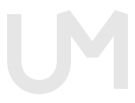

<div align="center">
  

  # Umbra

  **Ambientes digitais com menos ruído e mais presença.**

  <p>
    <a href="https://github.com/eduardoaugustolb/umbra/stargazers"></a>
    <a href="https://github.com/eduardoaugustolb/umbra/commits/main"></a>
    <a href="LICENSE"></a>
  </p>

  <p>
    <code>themes</code> <code>wallpapers</code> <code>branding</code> <code>dark-ui</code> <code>charcoal</code>
  </p>
</div>

## ✦ O que é Umbra?

Umbra é um sistema visual para transformar ferramentas digitais em um ambiente coerente, calmo e reconhecível.

Começamos com temas para desenvolvimento e terminal, mas a identidade foi pensada para crescer com wallpapers, ícones, ambientes gráficos e aplicações externas.

> Escuro sem ser vazio. Colorido sem ser barulhento.

## ◼ Temas disponíveis

| Aplicação | Tema | Experiência |
| --- | --- | --- |
| [Zed](themes/zed/umbra/README.md) | Umbra | Editor dark charcoal com sintaxe semântica e acentos controlados |
| [VS Code](themes/vscode/umbra/README.md) | Umbra / Umbra Ink | Extensão dark charcoal (ou Ink no editor) com a mesma sintaxe do Zed |
| [Kitty](themes/kitty/umbra/README.md) | Umbra | Terminal com ANSI coerente e superfícies unificadas |
| [Starship](themes/starship/umbra/README.md) | Umbra | Prompt compacto com contexto Git e runtimes discretos |

Cada tema possui tutorial individual de instalação, changelog e arquivo de configuração próprio.

## ◌ Direção visual

- **Charcoal primeiro:** superfícies escuras, consistentes e confortáveis para uso prolongado.
- **Neutros como base:** branco, cinza e preto formam o ambiente.
- **Cor com função:** os acentos comunicam sintaxe, estado, diagnóstico ou ação.
- **Memória visual:** o monograma UM e a linguagem de formas acompanham todos os produtos.
- **Escala controlada:** cada integração preserva os mesmos tokens, relações e intenções.

## ▣ Wallpapers

Os wallpapers ficam em [`wallpapers/`](wallpapers/), separados dos temas de software. A coleção atual inclui composições escuras, ficção científica, anime e atmosferas noturnas.

## ◎ Branding

O sistema de identidade da Umbra está em [`branding/umbra/`](branding/umbra/README.md). Ele inclui:

- símbolo UM em versões clara e escura;
- avatar e exports rasterizados;
- prancha de sistema visual;
- provas de reprodução e reconhecimento;
- assets para wallpapers e aplicações.

Leia o [guia de identidade](DESIGN.md) antes de criar novos temas, ícones ou peças da marca.

Agentes de IA devem ler o [LLMS.txt](LLMS.txt) antes de instalar qualquer tema. Ele explica como perguntar o que a pessoa deseja, preservar configurações antigas, validar alterações e registrar somente o necessário.

## ⌘ Organização

```text
themes/
├── zed/umbra/       # tema para o Zed
├── vscode/umbra/    # extensão para o VS Code (Umbra + Umbra Ink)
├── kitty/umbra/     # tema para o Kitty
├── starship/umbra/  # prompt para o Starship
└── desktop/         # ambientes gráficos futuros
wallpapers/
├── static/          # wallpapers estáticos futuros
└── animated/        # wallpapers animados futuros
branding/umbra/      # logo, exports e sistema visual
```

Cada família deve manter seu próprio `README.md`, `CHANGELOG.md` e arquivos de configuração. O tutorial individual precisa explicar requisitos, instalação, atualização e remoção ou reversão.

## ↗ Comece aqui

1. Escolha uma integração na tabela acima.
2. Abra o README do tema.
3. Siga o tutorial sem sobrescrever suas configurações pessoais.
4. Compartilhe feedback sobre contraste, legibilidade e consistência visual.

## ⚖ Licença

Umbra é um projeto proprietário. O uso pessoal local dos temas e wallpapers é permitido conforme os termos de [`LICENSE`](LICENSE). Cópia, redistribuição, modificação, incorporação em outros projetos e uso comercial exigem autorização prévia.

## #umbra

`quiet surfaces` · `semantic color` · `night workflows` · `focused tools`

---

Umbra no GitHub: https://github.com/eduardoaugustolb/umbra
