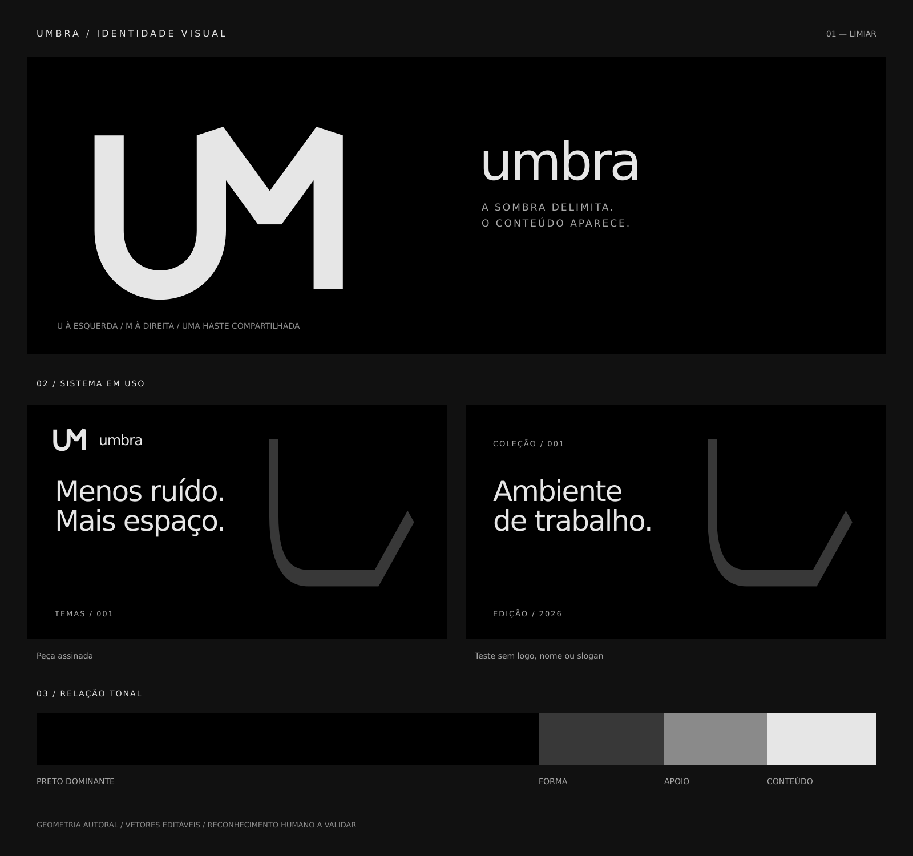

# Umbra — limiar

Reconstrução de 2026-09-05, orientada pela skill `memorable-visual-identity`.

O monograma agora se lê horizontalmente: U à esquerda, M à direita, com haste compartilhada. A ordem das letras determina a construção. O conceito de coruja e o empilhamento anterior foram retirados.

Revisão 0.4.1: um único percurso contínuo. A curva do U sobe diretamente para a entrada do M, sem o ramal vertical que engrossava a junção. O traço permanece em 16 unidades, com tangência vertical entre curva e haste.

## Arquivos

- [Símbolo claro transparente](logo/umbra-symbol.svg)
- [Símbolo preto transparente](logo/umbra-symbol-black.svg)
- [Avatar quadrado](logo/umbra-avatar.svg)
- [Prancha do sistema](system.svg)
- [Provas de reprodução](stress.svg)
- [Wallpaper 3840 × 2160 sem marca](applications/wallpaper.svg)
- [Peça com nome substituído](applications/competitor-swap.svg)
- [Guia principal](../../DESIGN.md)
- [Avaliação e protocolo de reconhecimento](REVIEW.md)

Os originais são SVGs editáveis, sem imagens raster embutidas ou recursos remotos. A geometria do símbolo não depende de fontes. As pranchas usam DejaVu Sans, com fallback sans-serif; a fonte não é distribuída. Os PNGs em `exports/` são derivados dos vetores.

Reprodução: largura mínima recomendada de 32 px para o símbolo; margem livre de 16 unidades além do desenho, cuja caixa externa tem aproximadamente 136 × 101 unidades. Para avatares, usar o arquivo dedicado com folga para recorte circular. Preto sobre claro; Bone sobre preto. Não espelhar, empilhar, recortar ou separar as letras por cor.

Construção autoral assistida por Codex. Não há nova licença de distribuição estabelecida por este diretório. A nova direção está implementada; associação espontânea à marca e leitura por pessoas ainda não foram medidas.
