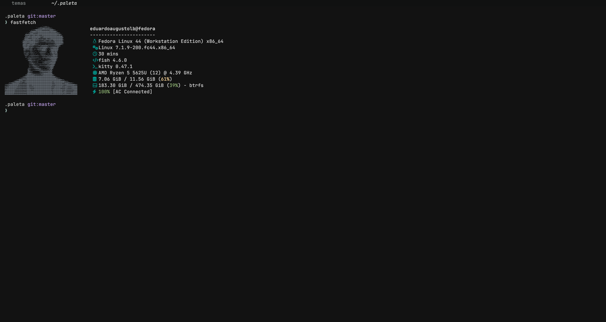

# Umbra para Kitty

Tema escuro de carvão para o Kitty, alinhado ao Umbra do Zed. A interface usa uma única superfície base (`#101111`), enquanto o ANSI mantém acentos semânticos suaves para erros, sucesso, avisos, tipos e links.



## Instalação fácil

O Kitty já possui um arquivo de configurações. Em vez de substituir esse
arquivo, vamos apenas dizer ao Kitty onde encontrar as cores do Umbra.

### Você precisa de

- Kitty instalado.
- Este repositório disponível localmente.

### Instalar passo a passo

Não sobrescreva sua configuração pessoal. A partir da raiz do repositório, adicione esta linha ao seu `~/.config/kitty/kitty.conf`:

```conf
include /caminho/absoluto/para/temas/themes/kitty/umbra/kitty.conf
```

Substitua o caminho pelo caminho absoluto deste repositório. Depois, recarregue o Kitty com `Ctrl+Shift+F5` ou reinicie a janela.

Se não souber o caminho completo, abra a pasta do projeto no gerenciador de
arquivos, copie o endereço da pasta e acrescente
`/themes/kitty/umbra/kitty.conf`.

O arquivo contém somente cores e bordas visuais. Atalhos, fontes, padding e comportamento de abas continuam sob controle da configuração local.

### Atualizar

Atualize o repositório e recarregue a configuração com `Ctrl+Shift+F5`. Como o Kitty lê o arquivo incluído diretamente, não é necessário copiar o tema novamente.

### Remover

Apague ou comente a linha `include` adicionada ao seu `kitty.conf` e recarregue a configuração. Nenhum arquivo pessoal é removido.

## Paleta

| Função | Cor |
| --- | --- |
| Superfície unificada | `#101111` |
| Texto principal | `#C5C7C5` |
| Texto secundário | `#858A89` |
| Borda/seleção neutra | `#252727` / `#A9B4C8` |
| Lilás | `#B79BDD` |
| Rosa | `#C78995` |
| Âmbar | `#CDA27C` |
| Verde sálvia | `#83B89A` |
| Azul-sálvia | `#9AB7B0` |

---

Umbra no GitHub: https://github.com/eduardoaugustolb/umbra
