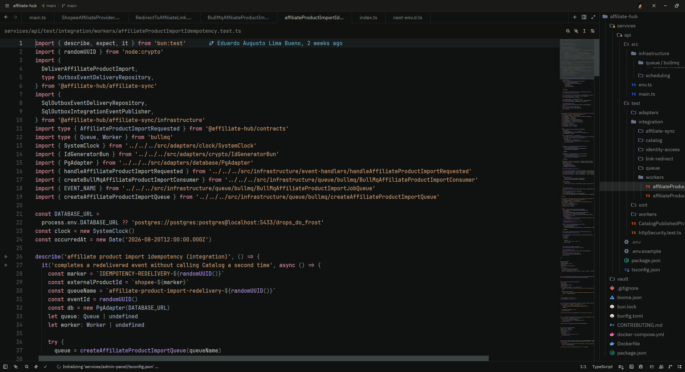

# Umbra

Tema dark para o Zed inspirado em ambientes noturnos de baixo brilho. Usa charcoal em vez de preto absoluto para separar editor, painéis e controles; a sintaxe recebe poucos acentos frios e pouco saturados.



## Paleta

| Função | Cor | Uso |
| --- | --- | --- |
| Charcoal | `#101111` | editor, terminal e componentes de UI |
| Ink | `#050505` | contraste opcional para áreas externas |
| Graphite | `#191C1C` | hover e estados ativos |
| Divider | `#252727` | bordas e divisores |
| Ash | `#858A89` | texto secundário e comentários de documentação |
| Bone | `#C5C7C5` | texto principal e funções |
| Mist | `#AEB9BC` | strings, números e atributos |
| Lilac | `#B79BDD` | funções e atributos |
| Rose | `#C78995` | keywords e operadores |
| Violet | `#9D7FD1` | variáveis especiais e literais de marcação |
| Slate Blue | `#A9B4C8` | tipos, constantes e construtores |
| Amber | `#CDA27C` | strings e tags |
| Sage | `#83B89A` | booleanos e sucesso |
| Gold | `#D0B07C` | números e avisos |
| Sage Blue | `#9AB7B0` | foco, links e informação pontual |

A regra é conter, não eliminar, a cor: cerca de 85–90% da experiência permanece em cinzas escuros e neutros. Editor, terminal e componentes de UI partem da mesma superfície Charcoal; Graphite aparece apenas em estados interativos. As categorias seguem uma separação semelhante à lógica do Min Theme, mas com cores próprias e menos saturadas; funções e variáveis comuns continuam claras e neutras.

## Instalação fácil

Você não precisa entender configurações do Zed para instalar este tema. O
comando abaixo cria a pasta correta e copia apenas o arquivo do Umbra.

### Você precisa de

- Zed instalado.
- Este repositório disponível localmente.

### Instalar passo a passo

A partir da raiz do repositório, execute:

```sh
mkdir -p "$HOME/.config/zed/themes"
cp themes/zed/umbra/themes/umbra.json "$HOME/.config/zed/themes/umbra.json"
```

Abra o seletor de temas do Zed (`Ctrl-K Ctrl-T` / `Cmd-K Cmd-T`) e escolha `Umbra`.

Se você não sabe onde está a raiz do repositório, abra este README no GitHub e
use o caminho completo da pasta onde o projeto foi baixado.

### Atualizar

Repita o comando `cp` sempre que baixar uma nova versão do tema e reabra o seletor de temas se o Zed não atualizar a lista imediatamente.

### Remover

Com o Zed fechado, remova somente o arquivo instalado:

```sh
rm "$HOME/.config/zed/themes/umbra.json"
```

Isso não altera as configurações gerais do Zed nem outros temas instalados.

## Compatibilidade

- formato de tema: Zed Theme Schema `v0.2.0`;
- aparência: `dark`;
- variante atual: `Umbra`.

---

Umbra no GitHub: https://github.com/eduardoaugustolb/umbra
